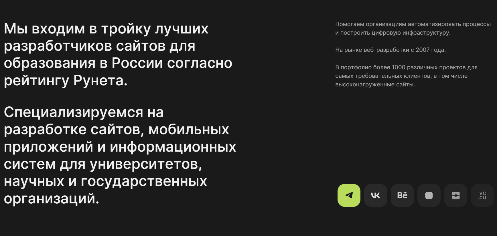
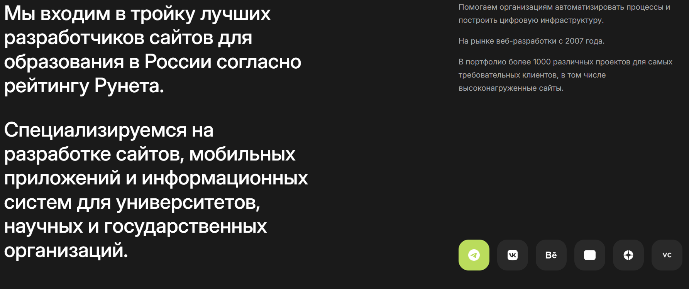

# АНАЛИЗ СОВРЕМЕННЫХ САЙТОВ
## ЛАБОРАТОРНАЯ РАБОТА №10 по дисциплине «Веб-технологии»

**Выполнил:** Студентка группы 241-671 Кудимова Е.В.

### 1. Анализ сайтов и свойств
### 1.1 Подборка сайтов:
1. **Kirpich Agency**
   - **Ссылка:** [https://kirpichagency.com/](https://kirpichagency.com/)
   - **Описание:** Креативное агентство, специализирующееся на разработке брендов, веб-дизайне и стратегиях маркетинга.

2. **Mish Design**
   - **Ссылка:** [https://mish.design/?rrcid=173711021999848148](https://mish.design/?rrcid=173711021999848148)
   - **Описание:** Студия веб-дизайна и UX/UI разработки для современных цифровых продуктов.

3. **Paraweb**
   - **Ссылка:** [https://paraweb.me/?rrcid=173711021999848148](https://paraweb.me/?rrcid=173711021999848148)
   - **Описание:** Веб-разработка и создание лендингов, корпоративных сайтов и онлайн-платформ.

4. **Blue Ant**
   - **Ссылка:** [https://blue-ant.ru/?rrcid=173711021999848148](https://blue-ant.ru/?rrcid=173711021999848148)
   - **Описание:** Агентство разработки веб-сайтов, мобильных приложений и комплексных решений для бизнеса.

5. **Dalee**
   - **Ссылка:** [https://dalee.ru/?rrcid=173711021999848148](https://dalee.ru/?rrcid=173711021999848148)
   - **Описание:** Разработка креативных решений в области графического и веб-дизайна.

6. **Uplab**
   - **Ссылка:** [https://www.uplab.ru/?rrcid=173711021999848148](https://www.uplab.ru/?rrcid=173711021999848148)
   - **Описание:** Агентство цифрового маркетинга, специализирующееся на разработке сайтов и приложений.

7. **Verno Digital**
   - **Ссылка:** [https://verno.digital/?rrcid=173711021999848148](https://verno.digital/?rrcid=173711021999848148)
   - **Описание:** Диджитал-агентство, занимающееся созданием и продвижением брендов в интернете.

8. **Art3D**
   - **Ссылка:** [https://art3d.ru/?rrcid=173711021999848148](https://art3d.ru/?rrcid=173711021999848148)
   - **Описание:** Производство 3D-графики, визуализации и разработка сайтов с использованием современных технологий.

9. **Ilartech**
   - **Ссылка:** [https://ilartech.com/?rrcid=173711021999848148](https://ilartech.com/?rrcid=173711021999848148)
   - **Описание:** IT-компания, занимающаяся разработкой программного обеспечения и веб-решений для бизнеса.

10. **Artw**
    - **Ссылка:** [https://artw.ru/?rrcid=173711021999848148#main](https://artw.ru/?rrcid=173711021999848148#main)
    - **Описание:** Студия веб-дизайна и графики с акцентом на креативные проекты и современные технологии.

### 1.2 Свойства:
| №  | Синтаксис (правила), значения, прочая информация | Назначение| Где встретилось (ссылка на страницу сайта) |
|----|-------------------------------------------------|---------------------------------------------------------------------------|----------------------------------------------------------|
| 1  | `aspect-ratio: <number>`                       | Устанавливает соотношение сторон элемента.                              | [https://kirpichagency.com/](https://kirpichagency.com/) |
| 2  | `backdrop-filter: blur(<length>)`              | Применяет размытие к заднему плану элемента.                             | [https://dalee.ru/](https://dalee.ru/)                  |
| 3  | `clip-path: polygon(<coordinates>)`            | Определяет форму элемента с помощью обрезки.                             | [https://paraweb.me/](https://paraweb.me/)              |
| 4  | `mask-image: url(<image>)`                     | Задает изображение для создания маски.                                   | [https://dalee.ru/](https://dalee.ru/)                  |
| 5  | `filter: contrast(<percentage>)`               | Изменяет контрастность элемента.                                         | [https://mish.design/](https://mish.design/)            |
| 6 | `overscroll-behavior: contain`                 | Предотвращает перетекание прокрутки на родительские элементы.            | [https://mish.design/](https://mish.design/)            |
| 7 | `shape-outside: circle(<radius>)`              | Определяет форму обтекания текстом вокруг элемента.                      | [https://verno.digital/](https://verno.digital/)        |
| 8 | `filter: drop-shadow(<offset-x> <offset-y>)`   | Применяет тень к элементу без создания отдельного слоя.                  | [https://art3d.ru/](https://art3d.ru/)                  |
| 9 | `isolation: isolate`                           | Создает новый контекст наложения для элемента.                           | [https://ilartech.com/](https://ilartech.com/)          |
| 10 | `perspective: <length>`                        | Определяет расстояние до элемента для создания 3D-эффекта.               | [https://artw.ru/](https://artw.ru/)                    |
### 2. 2.2 Структура сайта Ilartech
- **Ссылка на сайт:** [https://mish.design/?rrcid=173711021999848148](https://mish.design/?rrcid=173711021999848148)
- **Скриншот страницы:** 
#### Характеристика структуры:
1. **Использование методологии именования классов:** Методология BEM (Блок-Элемент-Модификатор) частично используется.
2. **HTML5 теги:** Теги `header`, `main`, `section`, `footer` 
3. **Использование оберток `div`:** Количество оберток умеренное, структура понятна.
4. **Удобство анализа кода:** Код организован логично, блоки имеют осмысленные названия классов, легко читаем.
### Структура сайта

#### 1. Шапка (Header)
- **Описание:** Включает логотип и меню навигации: 
- Секция "Услуги" с кратким описанием предоставляемых услуг.

 - Секция "Проекты" с примерами выполненных работ.

 - Секция "Команда" с фотографиями и описаниями участников.

 - Секция "Контакты" с формой обратной связи.
- **Свойства:**
  - Шапка фиксирована, остаётся в верхней части экрана при прокрутке. Реализовано с помощью свойства: `position: fixed;` 
  - Задний фон шапки полупрозрачный. Реализовано с помощью свойства: `background-color: rgba(0, 0, 0, .565);`
   - Элементы шапки организованы с использованием Flexbox (`display: flex;`)

#### 2. Основная часть (Main)
- **Описание:** Содержит секции заголовка и описания, рейтингов,основных партнеров, основных продуктов компании и формы для заполнения заявки
- **Свойства:**
  - Изображение под заголовком занимает всю ширину окна 
Реализовано с помощью свойства: `width: 100%; object-fit: cover;`
  - Карточки рейтингов выровнены по сетке.
 Реализовано с помощью свойства: `display: flex; flex-direction: column;`
 - При наведении курсором на форму, где можно писать текст, курсор меняет мстрелку на чёрточку  с засечками сверху и снизу.  `cursor: text ;`

#### 3.Подвал (Footer)
- **Описание:** Содержит копирайт и ссылки на социальные сети.
- **Свойства:**
  - Подвал фиксирован внизу страницы.
     Реализовано с помощью свойства: `position: relative; bottom: 0;` 

### 2.3 Пошаговая реализация блока сайта [https://paraweb.me/?rrcid=173711021999848148](https://paraweb.me/?rrcid=173711021999848148)
 
 ### 1. Откройте файл `index.html` и добавьте основную структуру: 

```html
html <!DOCTYPE html> 
<html lang="ru"> 
<head> 
<meta charset="UTF-8">  
<link rel="stylesheet" href="style.css">
 </head> 
 <body> 
 </body> 
 </html>
 ```

### 2. Установите заголовок сайта paraweb
```html
<title>paraweb</title>
```

### 3. Внутри секции head добавьте ссылки для подключения шрифта "Inter" 
```html
<link rel="preconnect" href="https://fonts.googleapis.com">

<link rel="preconnect" href="https://fonts.gstatic.com" crossorigin>

<link href="https://fonts.googleapis.com/css2?family=Comfortaa:wght@300..700&family=Inter:ital,opsz,wght@0,14..32,100..900;1,14..32,100..900&family=Montserrat+Underline:ital,wght@0,100..900;1,100..900&family=Vollkorn:ital,wght@0,400..900;1,400..900&display=swap" rel="stylesheet">
```

### 4. В css настраиваем параметры body
``` css

body{

    font-family: Inter, sans-serif;

    background-color: #1a1a1a;

}
```

### 5. Внутри body создайте все необходимые текстовые элементы
```html
<p> Мы входим в тройку лучших разработчиков сайтов для образования в России согласно рейтингу Рунета. </p>

<p>Специализируемся на разработке сайтов, мобильных приложений и информационных систем для университетов, научных и государственных организаций.</p>

<p> Помогаем организациям автоматизировать процессы и построить цифровую инфраструктуру.</p>

  <p> На рынке веб-разработки с 2007 года.</p>

  <p> В портфолио более 1000 различных проектов для самых требовательных клиентов, в том числе высоконагруженные сайты.</p>
```
### 6. Объедините текст в 2 группы по смыслу: about_lead и about_description
```html
<div class="about_lead">

            <p> Мы входим в тройку лучших разработчиков сайтов для образования в России согласно рейтингу Рунета. </p>

   

            <p>Специализируемся на разработке сайтов, мобильных приложений и информационных систем для университетов, научных и государственных организаций.</p>

</div>

<div class="about_description">

                <p> Помогаем организациям автоматизировать процессы и построить цифровую инфраструктуру.</p>

       

                <p> На рынке веб-разработки с 2007 года.</p>

                   

                <p> В портфолио более 1000 различных проектов для самых требовательных клиентов, в том числе высоконагруженные сайты.</p>

</div>
```
### 7. Настраиваем стили для текста
```css
p {

    margin-left: 1.2em;

    margin-right: 1em;

}
.about_lead p{

    color: white;

    max-width: 68%;

    font-weight: 500;

    font-size: 2.6rem;

    line-height: 1.2em;

}
.about_description p{

    color: #a7a7a7;

    margin-left: 0;

    font-weight: 400;

    font-size: 1rem;

    line-height: 1.7rem;

}
```
### 8.Создаем список ссылок на соц сети, где ссылка открывается в новой вкладке или окне браузера (target="_blank") с атрибутами безопасности и SEO (rel="nofollow noopener")  и назначаем класс ui-btn :
```html
<ul class="social">
   <li>
      <a href="https://t.me/unidigital" target="_blank" rel="nofollow noopener" class="ui-btn" >
      </a>
   </li>
<!-- Сделать таких пять штук -->
 ```

### 9. В каждую ссылку добавляем иконку в svg формате, присваивая класс icon.Можно сделать двумя способами :

- копируем ссылку в интернете на нужную иконку:

*пример для иконки телеграмма*
```html
<li>
   <a href="https://t.me/unidigital" target="_blank" rel="nofollow noopener" class="ui-btn">
      <svg xmlns="http://www.w3.org/2000/svg" width="16" height="16"  class="icon" viewBox="0 0 16 16">
         <path d="M16 8A8 8 0 1 1 0 8a8 8 0 0 1 16 0M8.287 5.906q-1.168.486-4.666 2.01-.567.225-.595.442c-.03.243.275.339.69.47l.175.055c.408.133.958.288 1.243.294q.39.01.868-.32 3.269-2.206 3.374-2.23c.05-.012.12-.026.166.016s.042.12.037.141c-.03.129-1.227 1.241-1.846 1.817-.193.18-.33.307-.358.336a8 8 0 0 1-.188.186c-.38.366-.664.64.015 1.088.327.216.589.393.85.571.284.194.568.387.936.629q.14.092.27.187c.331.236.63.448.997.414.214-.02.435-.22.547-.82.265-1.417.786-4.486.906-5.751a1.4 1.4 0 0 0-.013-.315.34.34 0 0 0-.114-.217.53.53 0 0 0-.31-.093c-.3.005-.763.166-2.984 1.09"/>
      </svg>
   </a>
</li>
```
- скачиваем файл в расширении svg, открываем в текстовом редакторе и копируем svg ссылку оттуда:

*пример для иконки vc.ru*
``` html
<li>
   <a href="https://vc.ru/u/822611-paraweb"  target="_blank" rel="nofollow noopener" class="ui-btn">

      <svg version="1.1" id="Layer_1" class="icon" xmlns="http://www.w3.org/2000/svg" xmlns:xlink="http://www.w3.org/1999/xlink" x="0px" y="0px" width="40px" height="40px" viewBox="0 0 512 512" enable-background="new 0 0 512 512" xml:space="preserve">  <image id="image0" width="512" height="512" x="0" y="0" href="data:image/png;base64,iVBORw0KGgoAAAANSUhEUgAAAgAAAAIACAQAAABecRxxAAAABGdBTUEAALGPC/xhBQAAACBjSFJN
                        AAB6JgAAgIQAAPoAAACA6AAAdTAAAOpgAAA6mAAAF3CculE8AAAAAmJLR0QA/4ePzL8AAAAJcEhZ
                        cwAADsMAAA7DAcdvqGQAAAAHdElNRQfpARIHEix1jFz7AAAhpklEQVR42u3deZxVxZ338U83iMii
                        KBBRCKsoi6KAirjFZ9wQg0vc44KKC4JLJj6Zycz4mETzvGLGJRjFDXE3EVSiosF9GwQRdwMIiAiI
                        UUEWEVCh6fkDsLvp7tu3b5/fqTr3933/lSD8TtWF+nbdc+pUlZQjIl6Vhm6AiISjABBxTAEg4pgC
                        QMQxBYCIYwoAEccUACKOKQBEHFMAiDimABBxTAEg4pgCQMQxBYCIYwoAEccUACKOKQBEHFMAiDim
                        ABBxTAEg4pgCQMQxBYCIYwoAEccUACKOKQBEHFMAiDimABBxTAEg4pgCQMQxBYCIYwoAEccUACKO
                        KQBEHFMAiDimABBxTAEg4pgCQMQxBYCIYwoAEccUACKOKQBEHFMAiDimABBxTAEg4pgCQMQxBYCI
                        YwoAEccUACKOKQBEHFMAiDimABBxTAEg4pgCQMQxBYCIYwoAEccUACKOKQBEHFMAiDimABBxTAEg
                        4pgCQMQxBYCIYwoAEccUACKOKQBEHFMAiDimABBxTAEg4pgCQMQxBYCIYwoAEccUACKOKQBEHFMA
                        iDimABBxTAEg4pgCQMQxBYCIYwoAEccUACKOKQBEHFMAiDimABBxTAEg4pgCQMQxBYCIYwoAEccU
                        ACKOKQBEHFMAiDimABBxTAEg4pgCQMQxBYCIYwoAEccUACKOKQBEHFMAiDimABBxTAEg4pgCQMQx
                        BYCIYwoAEccUACKOKQBEHFMAiDimABBxTAEg4pgCQMQxBYCIYwoAEccUACKOKQBEHFMAiDimABBx
                        TAEg4pgCQMQxBYCIYwoAEccUACKOKQBEHFMAiDimABBxTAEg4pgCQMQxBYCIYwoAEccUACKOKQBE
                        HFMAiDimABBxTAEg4pgCQMQxBYCIYwoAEccUACKOKQBEHFMAiDimABBxTAEg4pgCQMQxBYCIYwoA
                        EccUACKOKQBEHFMAiDimABBxTAEg4pgCQMQxBYCIYwoAEccUACKOKQBEHFMAiDjWOHQDRFLQnDa0
                        poSWNKaEcmAlG/iGdaxlBWtDNy+crAVAG7alFd+wjGVsCN2Y6LRkB3ZgDWv5jPWhGxNQKV3pQRc6
                        05nO/Ig2NM35+1fyT75kMV/yGR8xk3msC92FtJSUh25BPppwKIeyPz1pVelXFzGNqbzKm6GbF1gH
                        DmMg+9GTrX74tXV8zHReZSKfh25eahrTh/3Ykz3pTYsGVVrHPGbxIW8xlc9Cd8tW/AHQnV9wKjvk
                        +B0zGMv9LA3d0AC24hjO5Uga1fo7yniRm3myqGdLTTiQn3AAAxo47Gu2gNeYyhTeLc7PMO4A6MA1
                        nJbXjcpvuIYbnH2XG8L1dM/rd87gcp4J3VwDXRnEIP6F5ilcaymTeIpnWR6608mKNwBKGM619fqr
                        XcBFTArd7JR04E6OrNefGMdFRfSPd1dO5CT2Sv2665nCEzzE4tAfQFJiDYDm3M/x9f5TG7iKq4tz
                        qlbFQTzMjvX+Uws5hvdCN73B2nEWP2fPoG0o40UeYALfhP4wGi7OAGjNJPYp8M8+wcl8F7oDps7m
                        jkq3++pjFcfxYujmF6wxRzGMwQX2PXmrmcDNvBG6GQ0TYwC04nn6N+DPP8ZJRfwQ7CT+muOmX11W
                        M4jJobtQgDZcwAjah25GDaYyignZ/fcWXwCU8iRHNbDG/Qwluo4l4jCeokmDKixlbxaE7ka97M5l
                        nM42oZuRwyJu5FbWhG5GIeILgCu4OoEql3Bz6I4Y2JEPaNvgKm9wQGZ+Yu3NlfyUktDNyMPn/IHb
                        s/flM7YA6M3bDfwJt9Fa+jMrdGcS9xjHJlLnV1wXuit52JcrOTp0I+rlU37PnZSFbkZ9xBYAkxiU
                        UKXpDCiyrwGn8ZeEKq2iC1+F7k5OPfkjQ0I3oiBTOZs5oRuRv7jeBhyQ2PCHfTghdHcS1YjfJlar
                        JZeH7k4OO3Ir72d0+MNA3uGSTHxpAWILgBGJVvttZL1rmFPZNcFqw6J5mFZVE/6DuQzP3EtqlTXj
                        zzwf5ROLGsT0FaAZS2iWaMVTGB+6Uwkp4R/0SrTiEJ4M3alqDuEWeoZuREKWcDrPhW5E3WL6GXlw
                        wsMfLg3dpcQclvDwJ8EvW8n4EffyYtEMf2jL0/yuASs2UhJXACTtAPqG7lRCLk68YvKfdkOczAzO
                        ys4357yUciWT2C50M+pqZDx6G9QcGbpTiehs8Dhst2i+Z7fidsbRJnQzTBzOa3QM3YhcYgqATgY1
                        f07r0N1KwMUGU8kmtAvdLQCOZhYXhG6Eod5MoU/oRtQupgBoaVBzG84N3a0Ga2bUh/CT0624jomR
                        BJGd9rzK3qEbUZuYAsCmLSPivxFThzPY3qRu6G/cnXiVy4O3Ig3bMSnW25sxBcAKk6oW35/TlfwN
                        wI1WBO3V0bzNfkFbkKY2PEfn0I2oSUwBsNKortUASsch7GFUeUXAXv07T+Tc57H4tOepxB9zJyCm
                        AFhiVPcweoTuWgNYxdc3wfazacoDXBPVv7x09OL60E2oLqa/hhlGdUsy/DCwY0Lv/1Vn9WnXpR2v
                        cHqga4c23Oxvs2AxBcAHZpWHmjxhSMNFZk/r7T7tXHbhNfYNcuU4jKlyskUEYgqAd80qt2Ro6M4V
                        pCnnmdV+N0B/+vMaXQNcNx5t+c/QTagqpgCYx0dmtUdm8nHTaYbr455NvTeH8RI/Sv2qsRkR183P
                        mAIA/m5WuQeHhe5cAeyeX8xlbsp9OZonM/tFLEnNOT90EyqLKwAmGtbO3sPAA+hnVvuJlPsyhAls
                        nfI1Y3VG6AZUFtN+AFDKh3kedlV/ZXRnfugO1stDnGJUuZxefJhiT45jXCI7PRaLXVOff9UqrhnA
                        Bm4xq92Ii0J3r1525mdmtV9IdfgPYbyGfxURvYodVwDAPawyqz0s6r3ltzTccNOuNLdMP4hxkW4/
                        Fk5ErwbFFgAruNus9g78PHT38tbE8BXZuab3Wqrag8czFbvp6Ba6ARViCwC40XBf9ezcCDy5gMM/
                        8zUqteNTu/KM0ZuM2bZT6AZUiC8APuZxs9p7cWDo7uXpErPKy7g3pT5syxMx/VOPSIvQDagQXwDA
                        nwxrZ+OtgAGGy2VvZXUqfWjEX002eSsGET16izEAJjPNrPYJmdiv3e7n//eMTqkPoxic0pWyx+5G
                        d73FGAAwyqzyVnGtw6rRjpxoVvsh/plKH4Zn6H5L+qxefC9AnAHwCAvNal8Y/TPpCwzXzN2QSg/2
                        MYzwhlnPcpbzFcvNtp/Jx+zQH0OFWLaGrmo9N3GtUe12nMBfQ3cwh60Yblb7Bd5LoQetGBfRst+F
                        vM0M5jGPz/miyrAvpS1t6UZv+tCb3VJcrZDG30Ke4loKXKEVC81eHZnCAaG7l8MpPGRW+2jD1602
                        K2ECx5lfpW6f8TTP8FLe0+0mDGAQg+ibwnujuzAv7IdTIdYAgFFcZla7P2+H7l6tJpvF0yx6p3D/
                        +RemT3Hy8QaP8AzvF/in23EM55huVzor8WPeGiDeAOjKHLMNve+O9rSAvobRdAFjzNvfi7doan6V
                        2qzkL9yRyFYnvTmPoUaLmH7Fdal+KjnFGwDwCCcYVf6WH7M0dPdqdBfnGFVeQifWGrd+K6bS3/ga
                        tXmfGxmX6BqHlozkXxPfwmQlXVmW5geTW5xPATaym0o2ZVjoztWoDaeZ1b7FfPjDfwUa/nM4jb7c
                        lfASp1VcQxd+lfD26dfFNPzjngHANLMVcQvoZvjOQaF+zR+MKn9LJ740bn0/Xg/w3t9CruJe1hte
                        oQ2/YXhCz8tm0o/v0vlg8hPzDMDyqXUnhoTuXDWNDXcseMB8+DfijtSH//f8ll0Zazr8YSmX0J8p
                        CVRay5lxDf/YA+BRwwVB8a1UO8bsIOnyFBbmDE99+v8W+/C7lAbU+xzIeXzVoBobOCu+p09xB8B6
                        bjKrfSi7h+7eFi41qzzJ/BiQHfm98RWqWscfGVjwo75ClDOW7txR8IPUMs7lkRTbm6e4AwDGGL44
                        EdcWYXvwE7Pao8xbf32qB17MpR+/Zl2KV9xoORcyqKBFPMsYktpr2PUSewCs5C6z2meybejuVWL3
                        leR9njdu+8BU91p6mgH8I8XrVfUsvbisnq/zPEd/JgVrcU6xB4DlDkEtOTt0536wveFm0X8yX//3
                        36kdu1LOf/NTlqd0tZp9z5/pxtV5Ph6cxckcwSdBW5xD3I8BN7JbEDSHHpFsznC52eqwf9LF+EbZ
                        sTxmWr/Ct5wb0YtczTiVMzio1geE3/Icd/D31DZgK0gWAmB/XjOrPYhnQncPKGWu2Zl5V/D/Tdve
                        mPfpaXqFzdZyfBR/W1Vtz6H0pw/daMV2NGYVn/MJ7zCNF4MdwF4PWQgAeJ0BRpWfjGI9wBCzk3rW
                        0LGBD6/qci5jTetX9ORY83sZDsV/DwAsFwUPjuK0WrsHgPcYD/9G/Ltp/c3WcIyGv4VsBMCjLDDr
                        /4jQnaMHhxpV3sCNxm0/iV2NrwCwlqN4IYXrOJSNALBcEDSM5oF7d4nZPfSJzDFteUkqp92XM4xX
                        U7iOS9kIALiTr40qtzJ8Ay8f23KmWe1Rxm0fwh7GVwC4MqI7/0UnKwGw0vBWk93OQ/k4x2zrs7d4
                        2bjtvzSuDzDe+CmGc9l4CgDQhblmOwQdzP8E6lUJH5p9iz6DB03b3juF9XhTOJRvza/iWFZmADCf
                        v5nVDvdm4CCz4b+Y8cZtt//UVnCqhr+t7ASA5cPAn9EhUJ/szgC60fhlmZYprP+/iEXm13AuSwEw
                        hdeNKjc2PIw7l1040qjyN+YbgA41f5VqnOEG6bJJlgLAcg4wPMhRFhebff5jE97JrrqzjOt/FsEK
                        DQeycxMQoDEf0cmotvUts+pa8CnbmVQuY1c+Nm37bnxoWh+O4mnjKwhZmwGs589mtdO/EXiW0fCH
                        vxkPfzjduP5jGv7pyNYMAFqyyGzY7Mv0VPvygdmmZPsz1bjtc+huWH0duxuvYZRNsjUDgFWGOwSN
                        TLUndnsSTjMf/gNMhz/couGflqwFANxotgn0qYmfApOL3RuA15u3/VjT6su52rwHskn2AmCB2YKg
                        rVM8L6gzRxtV/sRwwdRmPzWt/nvjV5ilkuwFAFxrVvmihM5/qdtIs2XNdjOkzTqZvgK0nNuN2y+V
                        ZDEAppt9x/0xx6TSg23MjgD9mrvNW2/7BeDWhE/4k5yyGACWC4LSeRh4Oq2NKo9hpXnrBxnW/p7R
                        5u2XSrL2GHCjRswx28qrDx+Yt/89+pjUXU83w8PUNmrMMrMXmOE+hhq3X6rI5gygzPDnhP15QT8x
                        Gv7wsPnwh76Gwz+NM4ykimwGgOVUdyjbG7fd8g1Aewcb1p7OOyn0QCrJagCsMtshqJnxJLS92Y3G
                        V5lm2vKNLANgXArtlyqyGgBwk9njrhGmn8oItjKqbHdrtLIDzCqX83AqPZBKshsAnzDBqHJ3s7f0
                        YWvOM6r8MRPNWl2hs9nzC5iawh0M2UJ2AwCz0/Qs3wo4zWy58Q1mh6hWtpdhbX0BCCDLAWC3IOgo
                        uhlVtlpnsJx7jCpXtadZ5XIeSaUHUkWWA8DuW6/VeUH709+oxbeltH6ur1nl2XyWSg+kimwHwASz
                        c9fPNTkvyOrnf3rr5+xmAKE2Zncu2wFQZrZDUCuDPW924gSj1j7EYqPKVW1NR7PaCoAgsh0AcKfZ
                        gqBLEz+xbzhNjNo6yqjulroY/nuZnFIfpIqsB8Aq7jSq3DvhJS9NzLYefyG19XN2R6kvZn5KfZAq
                        sh4AlguCkv3GfiLtjNqZzgIggC5mlaek1gepIvsBsMBsQdBxiZ4XZLUF2GwmGVWuzurhKOabjEst
                        sh8AdguCGjM8sVr9GGDUyhvYYFS5OrsD1D5KrQ9SRTEEwHSzCeQFNE2o0i+MWriE+40q16SNWWUF
                        QCDFEAB234LbclJUdaq7hbVGlWuiACg6xREAf2OeUeXLEqlyYWIziaq+4zajftesrVHdr/ky1X7I
                        D4ojAMq42ahyf/ZtcI3GXGjUugf53KhyTUrYwaiy9UFmUqviCAAYa7YgqOEPA483unlWnuIDQIAW
                        ZguZVqTaD6mkWALAbkHQKezYwApWDwCf4R9GlWtm8zUGYFWq/ZBKiiUAYBTrTOo2aeAWHntxoFGP
                        bzCqW5utzSrrJIBgiicAPjVbENSwTbystgD9B88bVa6NXQB8k3JP5AfFEwB2C4J2bsBZONtzqlGr
                        biDtIx2s7gAoAAIqpgB4k9eMKhd+I/B8mpm06HP+YtTX2tkFgL4CBFNMAWC3IKjQozwaJbiYuKrR
                        fGdUuXZJvx5dobj+FWZKcX30j5ktCCpsi7BjjN6fW5vyAqCNvjerbLH7kuSluALAbkHQmQUtgrG6
                        AXgvS40q52I352gRoDcCFFsAwFijRSXNOLvef6YXh5i0pdxsI7Tc7GYACoBgii0A7BYE1f+8oOQ3
                        FdvoSWYZ9TE3zQCKULEFgN0OQd0YVK/f34ozjHqY7gLgCt+aVVYABFN8AbCQR40q1+9h4DlGt7be
                        4SWj/tVlldFaS8vXjKUOxRcAdguCBrFr3r+31Ox4sbQXAFco5yujyl2L8t9hJhTjB2+1IKiEi/L+
                        vYON9s9bzHiTuvlZYlS3KTsH7JVrxRgAdt+Sh9Eyz99p9QDwJsN78XWze/i4S8BeuVacAWC1IKhl
                        nucFdecwk+uvNnvGkR+rGYACIJjiDIAybjKqfElej/YuNfpcx5p9C8+P3fGddhuOS07FGQBwl9GC
                        oHwW97TkLJNr252EmC+7rbt6Be6ZW8UaAKsYY1S57oeBZ7OtyZUfN3vTIV92x3ftb/iqkeRQkvZL
                        5alpz/wGbeRRmzJ2yXkoeQkz6WHSowPNXnfOVy9mGNYOs77RuWKdAcBiowVBjTg/538/wmj42+12
                        kL/5hpuQWG2cJjkVbwDYLZk5P+f2mMkeKVrBanlTfazlU7PaCoAgijkAphudOd+WU2r9b90YbHLN
                        BWYLnOvnPbPKCoAgijkA7BYE1f5Tvv7vDObnz2aHoNePXQB01VqAEIo7AKwWBO3NfjX+eiG7BuRj
                        FWNN6tbfu4a1Tw7dOY+KOwA2mD05r/lVn7OMDs+6w+zco/qymwEoAIIo3seAG7VgEa0M6n5HJ77Y
                        4tdK+IDeBtdazy4sMKhbiFKWG61yAOjB7NAd9Ka4ZwDwjdGCoK25oNqv/R+T4Q+PRjP8YQNTDKuf
                        0vASUj/FHgBwk9E2FhdWW2Zk9QAw1A5ANfsfw9r6EpC64g+ARTxiUrc9x1X5/504xuQ6k5lmUrdQ
                        lgHQm4NDd8+b4g8AuN6obtWf+CNpZHKVcDsA1ewNw70B4V9Dd8+bYr8JuNGrHGRSd0/e3/S/tmER
                        rQ2uMI/dKDP7XArzktF25wAb2I2PQnfQEw8zgDQWBJ1uMvzhxuiGP0wyrF3KpaG754uPGUAps03W
                        ma2lA8sAeIt+BvWX0zHCk3N7MtOw+ho6Bt72xBUfMwCrBUHbcA4AB5kMf7gjwuEPs0z3JWjGZaE7
                        6ImPGQA0Z6HJKr0FdKOMhznRoPY6urHI+oMpyCjTQbqWHiwM3UUvfMwA7LbT7MRRtOdYk9rjIx3+
                        MNG0+jZcFbqDfniZAdjtEPQMb/GfJi3uxzu2H0nBSllIe8P6GxjAm6E76YOXGQAs5mGTukcwwqTu
                        y9EOf9hg9FluVsq1obvohZ8AsHoYWGLyslF8C4CqetC4/iFmR6tKFX6+AgC8kpmlpnPoyYbQjcjp
                        Q3Yzrb+SProVaM/TDCC212pytzTu4Q/3Gdffjru0Vbg9XzMAqwVBSVtGR1aHbkQd2rKIrY2vcVnw
                        o1CKnq8ZwAZuDN2EvNwS/fCHJUwwv8Y19AzdzWLnawYAzVhotGo/Od/RhX+GbkQeDjR9NXijjxlg
                        eCaxOJsBwJrA5+vm48FMDH+YzNvm1+jKozQJ3dFi5i0A4GajHYKSUs6o0E3Im9UZzJUdzM2hu1nM
                        /AXAp4wP3YScnuOD0E3I24Op7FZ4Pr8M3dHi5S8AiPwnbHYeVcK6lA4su5YzQ3e1WHm7CbhRvAuC
                        ZrCH4QGcyWvKx+yUwnXKGcmtoTtbjDzOAGJeZvunTA1/+Dal+VQJN9ewEXtMtqMje9CLDjQO3ZT6
                        8DkDiHVB0Bd0Nt1y00Iz5pi+GVihnEsYHbq7W2jBERzKnuzOdj/82jrmM53XeDLa17kr8RkAcHEq
                        d7Dr6zeZfBP+PKPDV6or5xquiGSRdCmHM5yjcqyGLGcqtzGe70I3NRevAdCcRWwfuhFbWEsnloRu
                        RAEa8UGKK/b+zumsCNzjUk7kN/TK6/cu5HfcE0lo1dgVn1ZzR+gmVHN/Joc/lPEfKV5tMNPyHHpW
                        BjCNcXm3oSNjeYXuQVucg9cZAHTgY5MdggpVTm9mhW5EwZ7jsBSvtorzAq3maMEfGFHAj82vOYvH
                        g7S4Dl5nAPEtCJqU4eEPF6f6Tbcl43iUdqn38nA+4OKCxsy2TGBY6u3Ng98AiG3JTbyPJvMx2+wA
                        ttr8jBkMTfF6O/EXnqVzwX++lDGclmJ78+T3KwDAy/wkdBM2eZe+oZvQQM2Y0YDhUainuYw55ldp
                        zEiuYtsG1/mWg5mexseSP88zgJjmAPG0pFBrGBFgEdMgZnCXcfAczjuMSmD4Q1PuY5tUPpe8+Q6A
                        icwN3QQAPuOh0E1IwCTGBrhqY85hNqPZ2aR6P57iWXZPrF4P/i2tDyY/vgMglh2Cbub70E1IxOV8
                        EuS6TRjBR9zNAYlW3YeJvMnghNv6y7g2pPF9DyCOHYKK6TjMA3kl6A+V2dzN3XzZwCpNGcIFHGq0
                        Kem/xXTqge8ZAKxJbRlr7e4umuEPkwPPqXbjGhbyBOcX+I7iNhzF7XzBeA4z25P43HAfT3XeZwB2
                        R4blawM9IrkTkYwmvMqA0I0AypnBy0zmLeblcXOyCb0YyGD+hWYptK07H4X+eDZTAMD9QU+heZzj
                        Qn8ACevE2yYnMRfqa2bwEfNYyFKWsoo1m359e7anHR3owx7sluoPgeHcHvpD2UwBAP14K+DVD05h
                        b920Hc1EHeqRwy2MDN2EzbzfAwB4m1eCXfvNIhz+8BTXhG5C1HqEbkAFBQCEXIab9gLatFwR56sv
                        kWgTugEV9BUAoISZQVL5U7pGvkl54VrwGn1CNyJS8+kaugmbaQYAUB5o7/lRRTv84RuO4YvQjYhU
                        RKNOM4CNmrMw9TvXq/gxK0N33NS+vECL0I2I0Ex6h27CZhFlUVCrAzyYubPIhz+8wbFx74gXSENX
                        KiZIAbDZ6JTX45dFuS1p0l7krHj3wwvmk9ANqKAA2GxxyjsETWB+6C6nYjwjM3bWgb2IDn9TAFRI
                        9538bO8AVB+3cakioIqpoRtQQTcBK3uJQ1K60pSEX12N3fncph82m3xFO9aHbsRm+kupLL2fytnf
                        Aah+xuiLwA8ei2f4awZQVSmz2DWF68ynO2WhO5u6oYyJaiP2UPaNaV9AzQAqS2uHoBsdDn+4l+NY
                        HboRwb0S0/DXDGBLzVhkviBoBR1ZFbqjgQzgyZhWwgdwAFNCN6EyzQCqWpPCgqAxboc/TOPAotr+
                        pL7uiWv4awZQ3c7Mp4lh/XV0y8Kx0Ya25yGOCN2IIBbTh2WhG1GVZgBb+oxxpvXHOx/+sJzB/DF0
                        IwJYz2mxDX/NAGrSl7cNq+8ddP+heJzN6FT234tFOedyT+hGVKcZQHXv8JJZ7Zc1/De5h/4xLYk1
                        939jHP4KgJrZLdPxtgAolw8ZyL2hG5GS/4p16be+AtTEakHQXHro3bgtnMFNtArdCFPruYxbQjei
                        NpoB1GQDo0zq/knDv5oH6MnE0I0wtIrj4x3+mgHUxuLIsK/o+MOe9FJZCedzHS1DN8PAPI5lRuhG
                        5KIZQM3WGOwSOFrDvxbl3EFv/ha6GYm7n35xD3/NAGq3HZ8k+t10NZ1ZGrpTkTuU0ewWuhEJ+ZqR
                        PBC6EXXTDKA2KxOeA9yq4V+nF+jL1UUxT3qePlkY/poB5LID89k2oVpr6crnoTuUEe25iqE0Ct2M
                        gi3lcu7Pyu4HmgHUbhm/TazWHzX887aYYfRlUuhmFKSc++jJfVkZ/poB5NaIN+iXQJ059NH22PU2
                        kP/HUaEbUS+v8+uA50wWRDOAXMq4MJGtO0Zq+BdgKoPZi4cz8tN0Jiezf9aGvwKgLm9ydYNr3MTz
                        obuRWe9xMnswhrWhG5LTDM5kj8xEVRX6ClCXEh7l+Ab8+Zc5oohPAExLay5gBB1CN6MGz3MDT2dx
                        6G+kAKhbS6awe4F/dj776vFfQhpxJOcwhK1DN2STNYxnFO+FbkbDKADy8SMmFXQzcDZHsiB044tM
                        a07nNAZQErAN5bzKvTxSDFu7KQDysy2P1/vQkOkczZLQDS9SP+YETmRg6vewynmXx7i/eI51UwDk
                        a2uu5Fd572tfxk1coU2wjbXjSI7gcNqmcK21vMhEnuLT0J1OlgKgPvbidvbN4/e9w0VMC91YN0rp
                        yyEcwEDaGVT/mqlMZSqTi2KJcjUKgPo6iJH8rNaZwHoeYzQvh26kU90YyJ70YXd2bmClL5jJbN5l
                        CjOKew8HBUAhWrE/A9mPHdmBHYBlLONLXmcKU1keunECtKYXXehCZzqzE23q2NthHV/yOZ/zJYtZ
                        wEw+jG/3XisKAPGglNa0pjkltAJKKOd7VlPG15SzwnNoKwBEHNNSYBHHFAAijikARBxTAIg4pgAQ
                        cUwBIOKYAkDEMQWAiGMKABHHFAAijikARBxTAIg4pgAQcUwBIOKYAkDEMQWAiGMKABHHFAAijikA
                        RBxTAIg4pgAQcUwBIOKYAkDEMQWAiGMKABHHFAAijikARBxTAIg4pgAQcUwBIOKYAkDEMQWAiGMK
                        ABHHFAAijikARBxTAIg4pgAQcUwBIOKYAkDEMQWAiGMKABHHFAAijikARBxTAIg4pgAQcUwBIOKY
                        AkDEMQWAiGMKABHHFAAijikARBxTAIg4pgAQcUwBIOKYAkDEMQWAiGMKABHHFAAijikARBxTAIg4
                        pgAQcUwBIOKYAkDEMQWAiGMKABHHFAAijikARBxTAIg4pgAQcUwBIOKYAkDEMQWAiGMKABHHFAAi
                        jikARBxTAIg4pgAQcUwBIOKYAkDEMQWAiGMKABHHFAAijikARBxTAIg4pgAQcUwBIOKYAkDEMQWA
                        iGMKABHHFAAijikARBxTAIg4pgAQcUwBIOKYAkDEMQWAiGMKABHHFAAijikARBxTAIg4pgAQcUwB
                        IOKYAkDEMQWAiGMKABHHFAAijikARBxTAIg4pgAQcUwBIOKYAkDEMQWAiGMKABHHFAAijikARBxT
                        AIg4pgAQcUwBIOKYAkDEMQWAiGMKABHHFAAijikARBxTAIg4pgAQcUwBIOKYAkDEMQWAiGMKABHH
                        FAAijikARBxTAIg4pgAQcUwBIOKYAkDEMQWAiGMKABHHFAAijikARBxTAIg4pgAQcUwBIOKYAkDE
                        MQWAiGMKABHHFAAijikARBxTAIg4pgAQcUwBIOKYAkDEMQWAiGMKABHH/hcaM6GCy0DmDwAAACV0
                        RVh0ZGF0ZTpjcmVhdGUAMjAyNS0wMS0xOFQwNzoxODo0NCswMDowMLtt9uMAAAAldEVYdGRhdGU6
                        bW9kaWZ5ADIwMjUtMDEtMThUMDc6MTg6NDQrMDA6MDDKME5fAAAAGXRFWHRTb2Z0d2FyZQB3d3cu
                        aW5rc2NhcGUub3Jnm+48GgAAAABJRU5ErkJggg==" />

      </svg>
   </a>
</li>
```
### 10. Добавьте стилизацию для меню соц сетей
```css
.ui-btn { 
   display: inline-flex; 
   align-items: center; 
   justify-content: center; 
   width: 4.4rem; height: 4.4rem;
   background-color: #292929; 
   border-radius: 1.5rem; 
   } 
a {
    text-decoration: none
}
.icon {
    width: 24px;
    height: 24px;
    fill: white; 
}
```
### 11. Добавить переход в зеленый цвет при наведении
```css
.ui-btn { 
   display: inline-flex; 
   align-items: center; 
   justify-content: center; 
   width: 4.4rem; 
   height: 4.4rem; 
   background-color: #292929;
   border-radius: 1.5rem; 

   transition: background-color 0.3s;
   }

ui-btn:hover {
    background-color: #badc5c;
     }
```


### 12. Объедините класс about_description и social (меню соц сетей) в класс right_side

```html
<div class="right_side">

   <div class="about_description">
      <!-- ... -->
   </div>

   <ul class="social">
      <!-- ... -->
   </ul>

</div>

```
### 13. Определите с помощью flex расположение элементов  относительно друг друга в этом классе
```css
 .right_side{
    display: flex;
    flex-direction: column;
    justify-content: space-between;
    margin-left: 1em;
    margin-right: 1em;
    margin-top: 1.5em;
    margin-bottom: 1.5em;
}
```
### 14. Объедините  класс right_side и about_lead в класс element с помощью div
```html
<div class="element">
   <div class="about_lead">
      <!-- ... -->
   <div class="right_side">
      <div class="about_description">
         <!-- ... -->
      </div>
      <ul class="social">
         <!-- ... -->
      </ul>
   </div>

</div>
```

### 15. Определите с помощью flex расположение элементов  относительно друг друга в этом классе
```css
.element{
    display: flex;
    flex-direction: row;
    justify-content: space-between;
}
```
Итог:
 

### 2.4 
1. freeCodeCamp
Онлайн-платформа с практическими заданиями по HTML, CSS, JavaScript и другим технологиям.

2. CSS-Tricks
Блог с качественными статьями, туториалами и примерами по CSS и веб-разработке.

3. Frontend Mentor
Платформа для практики верстки с реальными макетами для реализации.

4. Smashing Magazine
Онлайн-журнал с актуальными статьями по фронтенд-разработке, дизайну и UX.

5. The Net Ninja (YouTube)
Канал с обучающими видео по веб-разработке, включая HTML, CSS, SASS и другие темы.

6. Kevin Powell (YouTube)
Отличный канал для глубокого изучения CSS. Простое объяснение сложных тем.

7. Frontend Roadmap
Карта изучения фронтенда с последовательностью тем и ссылками на полезные материалы.

8. Codrops
Ресурс с экспериментальными UI/UX-проектами, туториалами и идеями для верстки.

9. Designmodo
Блог и магазин инструментов для веб-дизайна и разработки с качественными уроками.

10. Telegram-канал: Frontend и CSS
Канал с советами, новостями, библиотеками и интересными проектами для фронтенд-разработчиков.


